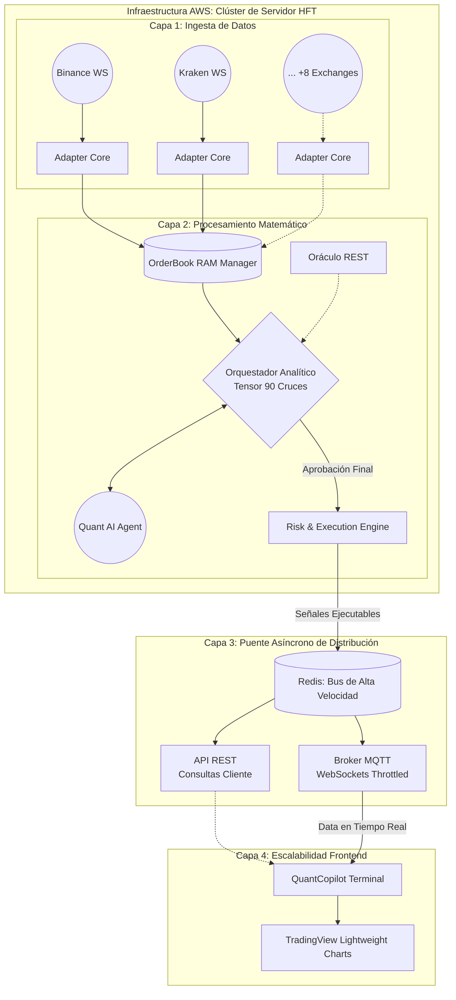
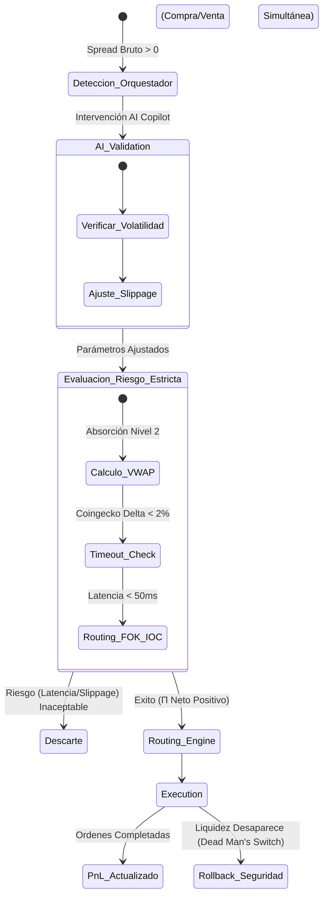
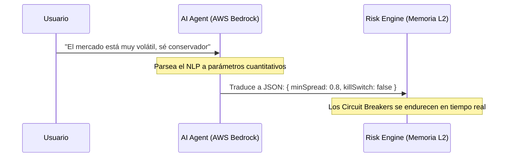
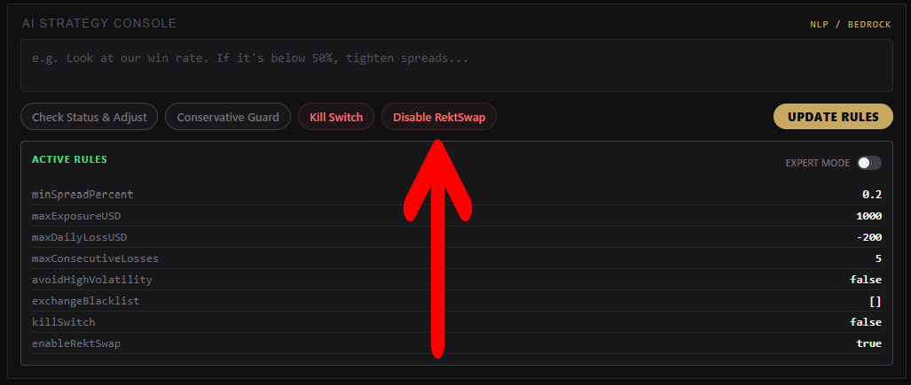

# QuantCopilot

> Capa Inteligente de Supervisión para Trading de Alta Frecuencia (HFT), Orquestación de Riesgo con IA y Ejecución de Rentabilidad Neta

## Fast Links
* **Aplicación en Producción:** [https://quantcopilot.expo.app/](https://quantcopilot.expo.app/)
* **WebServer Code:** [./ws_server/](./ws_server/)
* **App Code:** [./QuantCopilot/](./QuantCopilot/)

## Introducción
// To be done

## El Problema
// To be done

---

## Arquitectura de la Solución

La arquitectura está diseñada para garantizar la máxima velocidad en el flujo de datos mediante una estricta separación de responsabilidades. Desplegado sobre infraestructura **AWS**, el clúster del servidor se dedica exclusivamente a la ingesta cruda desde los exchanges y al procesamiento matemático intensivo. Para no entorpecer este motor HFT, el puente de comunicación utiliza **Redis** como bus de alta velocidad, distribuyendo la información asincrónicamente a los clientes mediante una API REST y un broker MQTT sobre WebSockets de frecuencia limitada (*throttled*).



### Flujo de Datos en Tiempo Real
1. **Capa 1 - Ingesta de Nivel 2:** En el directorio [`ws_server/ws_modules/`](./ws_server/ws_modules/), cada exchange cuenta con un adaptador dedicado (ej. [`ws_binance.js`](./ws_server/ws_modules/ws_binance.js)) que establece un `WebSocket` directo. Estos normalizan la estructura asimétrica de cada API de mercado (L2) hacia un formato unificado. *(Nota: La capacidad de ingesta está delimitada por los tiers gratuitos de las APIs usados en el hackathon, pero escala logarítmicamente con endpoints de pago).*
2. **Capa 2 - Memoria y Orquestación:** Los adaptadores inyectan los *ticks* en diccionarios de memoria RAM viva ($O(1)$) evadiendo cuellos de botella de bases de datos. Simultáneamente, el cerebro matemático ([`orchestrator.js`](./ws_server/orchestrator.js)) cruza las combinaciones para detectar spreads brutos, restando slippage y comisiones al instante.
3. **Capa 3 y 4 - Distribución al Frontend:** El archivo [`index.js`](./ws_server/index.js) levanta un Broker MQTT ligero y una API REST. El servidor filtra las señales y aplica un estrangulamiento de red (*throttling*) a 2Hz. Esto permite que la aplicación cliente ([`QuantCopilot/`](./QuantCopilot/)) y los gráficos TradingView Lightweight se actualicen fluidamente sin sobrecargar el hilo del navegador, manteniendo la velocidad extrema del core matemático intacta.

## Fundamentos Matemáticos del Motor de Arbitraje

El motor de QuantCopilot no opera basándose en "spreads nominales", sino que implementa un modelo cuantitativo en tiempo real que evalúa la rentabilidad neta esperada ($\mathbb{E}[\Pi]$) considerando costos de fricción, latencia de red y profundidad del mercado (Nivel 2). *(Ver implementación matemática en [`ws_server/orchestrator.js`](./ws_server/orchestrator.js)).*

### 1. Cálculo de Rentabilidad Neta Estricta ($\Pi_{net}$)

La oportunidad de arbitraje solo se considera viable si la función de beneficio neto arroja un valor estrictamente positivo tras deducir las comisiones operativas y de transferencia. La ecuación base procesada es:

$$ \Pi_{net} = \min(V_{ask}, V_{bid}) \times \left[ P_{bid} (1 - f_{taker}^{sell}) - P_{ask} (1 + f_{taker}^{buy}) \right] - C_{gas} $$

Donde:
* **$P_{ask}$**: Precio del mejor *Ask* en el exchange de compra ($E_1$).
* **$P_{bid}$**: Precio del mejor *Bid* en el exchange de venta ($E_2$).
* **$V_{ask}, V_{bid}$**: Volúmenes disponibles en el primer nivel de profundidad del *Order Book*.
* **$f_{taker}^{buy}, f_{taker}^{sell}$**: Comisiones de ejecución en cada plataforma.
* **$C_{gas}$**: Costo dinámico de transferencia inter-exchange (calculado y validado en tiempo real).

### 2. El Orquestador: Motor de Matrices Cruzadas $O(N^2)$

El Orquestador no es un sistema secuencial tradicional. Modela el mercado como un grafo dirigido ponderado $G = (V, E)$, donde $V$ son los activos y $E$ representa la viabilidad de ejecución. Para $N$ exchanges, existen $\binom{N}{2} \times 2 = N(N-1)$ combinaciones direccionales.

$$ \text{Evaluación del Orquestador} = \sum_{i=1}^{N} \sum_{j \neq i}^{N} (E_i \to E_j) \implies O(N^2) $$

Con 10 exchanges integrados, el Orquestador evalúa simultáneamente un tensor de $10 \times 9 = 90$ vectores de spread concurrentes por cada evento de actualización de los libros de órdenes. 

**¿Por qué un Grafo y no condicionales (`if/else`)?**
Codificar combinaciones cruzadas mediante condicionales estáticos crea árboles de ejecución inmanejables y degrada la latencia. El enfoque matricial resuelve el cálculo de forma simétrica y predecible, permitiendo que escalar a nuevos exchanges ($N+1$) requiera cero modificaciones sobre el motor matemático base. *(Ver lógica de cálculo en [`ws_server/orchestrator.js`](./ws_server/orchestrator.js)).*

---

## Motor de Riesgo (Risk Engine) y Circuit Breakers

En HFT, detectar el spread es solo el primer paso; el reto real es mitigar el riesgo de ejecución antes de que la liquidez desaparezca. El Risk Engine actúa como el sistema de validación para las decisiones del Orquestador.



### Mecanismos Defensivos del Risk Engine
1. **Modelado de Profundidad (VWAP Absorber):** El motor no asume que la orden entera se llenará al mejor precio. Consume virtualmente el Nivel 2 del Order Book, sumando el costo de *slippage* hasta que la orden se completa. Si durante esta absorción virtual el $\Pi_{net}$ cae por debajo de cero, la operación se bloquea.
2. **Routing Restrictivo FOK / IOC:** El motor asume asimetría de red. Toda orden se despacha como *Fill-Or-Kill* (FOK) o *Immediate-Or-Cancel* (IOC). Esto evita el *leg-risk* (quedar expuesto al comprar en Exchange A pero fallar la venta en Exchange B).
3. **Dead Man's Switch (Cancel-on-Disconnect):** Integrado a nivel de *socket layer*. Si el servidor experimenta un micro-corte de conexión con los nodos, el Risk Engine emite automáticamente paquetes `SIGTERM` para cancelar cualquier orden límite pendiente en el mercado.

---

## Ecosistema de Liquidez (Capa de Ingesta WSS)

Para que el motor $O(N^2)$ sea efectivo, requiere un flujo de datos hiper-preciso e ininterrumpido. El sistema descarta por completo el uso de APIs REST (*polling*) debido a su latencia. En su lugar, el orquestador mantiene **conexiones de WebSocket (Nivel 2) activas y concurrentes** contra los *endpoints* reales de 10 exchanges globales.

* **Normalización Asíncrona:** Cada plataforma (Binance, Kraken, Coinbase, OKX, etc.) transmite su *Order Book* con arquitecturas y esquemas JSON radicalmente distintos. Los módulos en `ws_modules/` actúan como micro-traductores que normalizan la estructura de datos al vuelo antes de inyectarlos en el diccionario de memoria viva.
* **Resiliencia de Red (Ping/Pong Automático):** Mantener 10 túneles WSS estables es un reto de infraestructura. La capa de ingesta gestiona automáticamente el estado de salud de cada conexión, respondiendo a *pings* de mantenimiento (ej. KuCoin/Bitfinex) y ejecutando reconexiones con *backoff* exponencial instantáneo ante micro-cortes.
* **Arbitraje de Fragmentación:** Al consolidar 10 nodos en un solo tensor, el orquestador obtiene una visión panóptica del ecosistema global, detectando divergencias milisegundos antes de que los propios *Market Makers* de los exchanges logren equilibrar el mercado.

*(Ver la implementación de los adaptadores asíncronos en [`ws_server/ws_modules/`](./ws_server/ws_modules/)).*
---

## QuantCopilot AI Agent

A nivel técnico, **los LLMs actuales son demasiado lentos** para operar directamente dentro de un bucle de *Trading* de Alta Frecuencia (sub-milisegundo). Por lo tanto, el AI Agent no ejecuta órdenes; funciona como una capa de supervisión superior (Copiloto). Su propósito es democratizar el ecosistema, permitiendo que operadores sin conocimientos hiper-expertos en matemáticas cuantitativas puedan gestionar el riesgo de la plataforma.

* **Traducción de Intención a Parámetros:** El usuario interactúa en lenguaje natural ("El mercado está volátil, sé más conservador"), y el Agente traduce esta instrucción ajustando instantáneamente las variables del Risk Engine (endureciendo los *Circuit Breakers* o aumentando la exigencia de $\Pi_{net}$).
* **Terminal Cognitiva (Explicabilidad XAI):** Actúa como un analista *on-demand*. Mientras el motor matemático (Orquestador) opera a máxima velocidad, el Agente puede leer los registros y explicarle al usuario, en texto simple, por qué el sistema rechazó operaciones que en papel parecían rentables.
* **Roadmap a Futuro:** Aunque hoy la latencia de inferencia relega a la IA a un rol de asistencia macro, la arquitectura del sistema sienta las bases para que, conforme el hardware neuronal evolucione, los modelos predictivos puedan integrarse progresivamente en la toma de decisiones directas de ejecución.

*(Para auditar la integración del LLM, ver [`ws_server/tools/ai-agent.js`](./ws_server/tools/ai-agent.js) y [`ws_server/tools/strategy-parser.js`](./ws_server/tools/strategy-parser.js)).*



---

## Auditoría y Acceso a la Plataforma (Entorno Live)

El simulador algorítmico y dashboard de monitoreo operan actualmente en producción.

### Enlaces de Acceso
* **Terminal Dashboard:** [🔗 Iniciar QuantCopilot](https://quantcopilot.expo.app/)

### Funcionamiento del Cliente Web
El principio rector de la arquitectura es proteger los recursos computacionales del clúster HFT. Por ello, **toda la matemática tensorial ($O(N^2)$) y evaluación de riesgo ocurre exclusivamente en el servidor backend**. El cliente es una terminal visual y pasiva que opera de la siguiente manera:

1. **Autenticación (JWT):** Al inicializarse, el cliente recibe un token de seguridad con una vigencia estricta de 1 hora para habilitar la conexión de WebSockets. Tras este lapso, la sesión caduca y es necesario refrescar la página.
2. **Estado Base (REST API):** El *dashboard* extrae los valores históricos y el estado acumulado (PnL, configuración de reglas) mediante una llamada inicial al servidor.
3. **Telemetría en Vivo (MQTT sobre WS):** Toda la data en tiempo real (las 90 combinaciones de spread y los marcadores de ejecución en el gráfico) llegan al cliente vía un túnel MQTT empujado (*pushed*) por el servidor. De esta forma, el *frontend* muestra el ecosistema sin bloquear ni interactuar de más con el Orquestador HFT.

> **Nota para la Demostración (El Simulador RektSwap):** El arbitraje real inter-exchange ocurre esporádicamente. Para evitar que el jurado espere frente a una pantalla estática, el sistema integra **RektSwap**, un exchange fantasma (Nodo 11). RektSwap lee pasivamente el precio en tiempo real de Binance y le inyecta una desviación algorítmica (ruido/exageración). Esto genera *spreads* artificiales de forma continua que "despiertan" al motor $O(N^2)$ y obligan al Risk Engine a reaccionar, evaluar y bloquear operaciones en vivo. Es una herramienta de estrés diseñada puramente para auditar el sistema durante la presentación. Este puede apagarse y encenderse desde el panel de control.



---

## Arquitectura del Repositorio y Pruebas Locales

El proyecto está diseñado de forma modular para permitir pruebas aisladas de cada componente crítico antes de integrarlos al flujo de producción completo. A continuación, se detalla la estructura del código fuente y cómo ejecutar los entornos localmente.

### 1. Módulo de Ingesta Aislada (`ws_standalone/`)
Este entorno contiene los adaptadores de conexión en su forma más pura, sin intervención de la capa matemática o de distribución.
* **Propósito:** Sirve única y exclusivamente para probar la ingesta en bruto desde los exchanges. Es ideal para validar la estabilidad de la conexión a los WebSockets (Nivel 2) de los 10 nodos, depurar latencias de red o monitorear caídas y reconexiones automáticas de las APIs.
* **Ejecución Local:** 
  ```bash
  cd ws_standalone
  npm install
  node ws_kucoin.js
  ```

### 2. Motor Matemático y Risk Engine (`ws_orchestrator/`)
Este directorio contiene el cerebro algorítmico del proyecto, pero despojado del peso de la red de distribución.
* **Propósito:** Muestra cómo el Orquestador central recibe todos los datos consolidados de la carpeta anterior y ejecuta su lógica cruzada $O(N^2)$. Es el entorno de depuración perfecto para visualizar en terminal la detección de *spreads* brutos, la aplicación del modelo de fricción/VWAP y la ejecución virtual de las operaciones en tiempo real cuando $\Pi_{net} > 0$.
* **Ejecución Local:** 
  ```bash
  cd ws_orchestrator
  npm install
  node orchestrator.js
  ```

### 3. Servidor HFT de Producción (`ws_server/`)
Este es el clúster integral y definitivo (el que corre en AWS).
* **Propósito:** Empaqueta tanto los adaptadores de ingesta como el orquestador matemático, y les añade una capa de distribución masiva y asíncrona mediante un **Broker MQTT** y una **API REST**. Es el servidor *backend* completo al que debe conectarse la aplicación gráfica.
* **Ejecución Local:** 
  ```bash
  cd ws_server
  npm install
  node index.js
  ```
  
> **Nota de despliegue:** Aunque la lógica matemática corre sin problemas en local, se necesitan las credenciales de AWS Bedrock para el funcionamiento de la IA. Si prefieren saltarse la configuración del `.env`, pueden evaluar el sistema completo directamente aquí: [🔗 QuantCopilot Web](https://quantcopilot.expo.app/)

### 4. Terminal Gráfica del Cliente (`QuantCopilot/`)
La aplicación *frontend* construida con **React**, **Expo** y **Tailwind CSS**.
* **Propósito:** Es el Dashboard de usuario donde interactúa el Copiloto AI. Se conecta asincrónicamente mediante WebSockets a `ws_server/` para consumir los datos de mercado filtrados (a 2Hz) y renderizarlos fluidamente usando TradingView Lightweight Charts, sin colapsar la memoria del navegador.
* **Ejecución Local:** 
  ```bash
  cd QuantCopilot
  npm install
  npm run web
  ```

> **Nota de ejecución:** Levantar el frontend en *localhost* obliga a tener el backend configurado con las credenciales de AWS Bedrock y las credenciales del broker MQTT para poder pasar el *handshake* de seguridad. Para facilitarles la revisión, hemos dejado la app corriendo en vivo en: [🔗 QuantCopilot Web](https://quantcopilot.expo.app/)